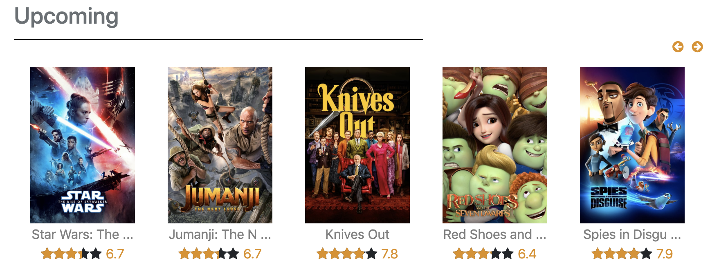
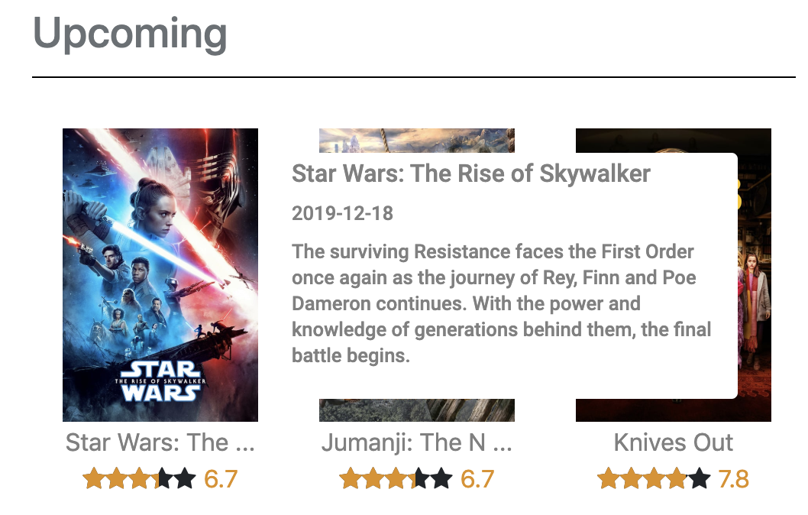
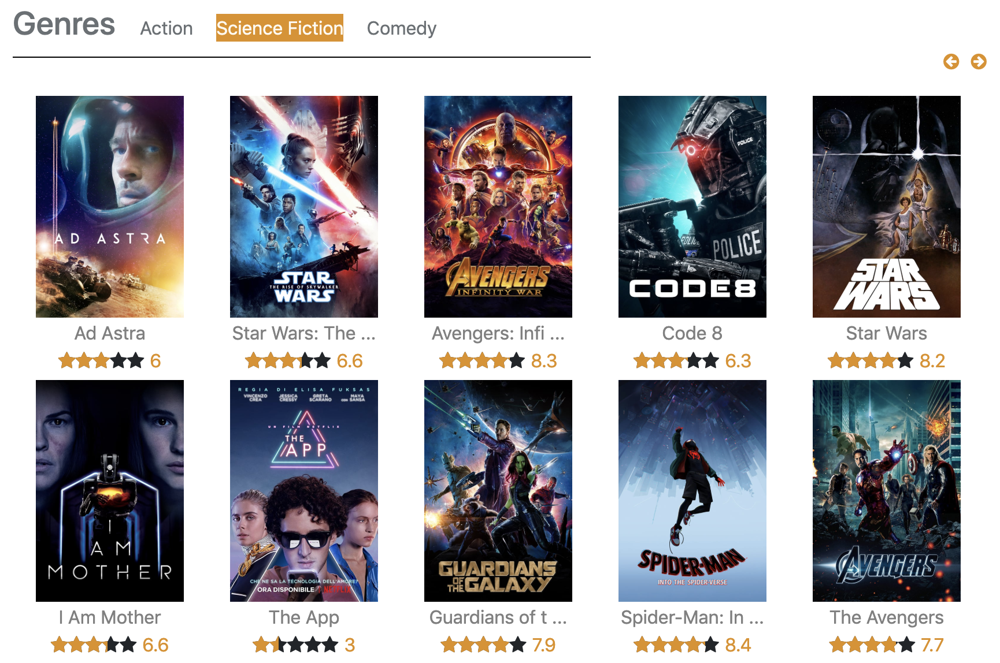
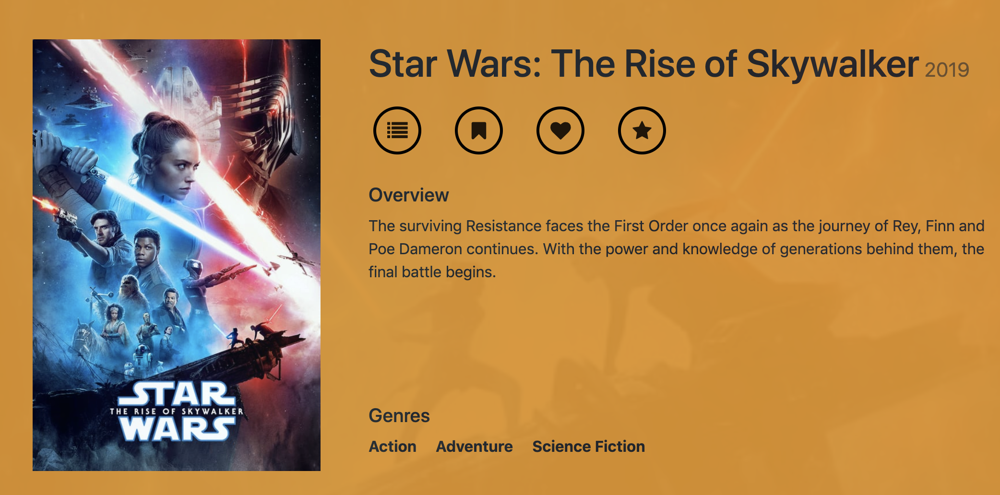
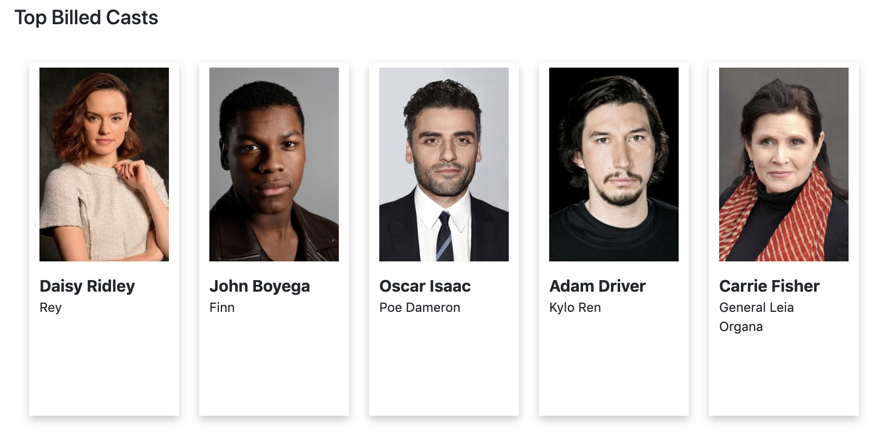
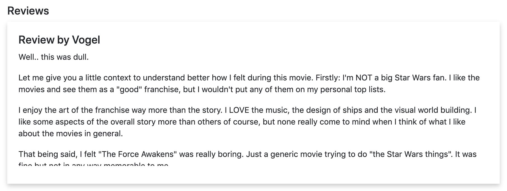
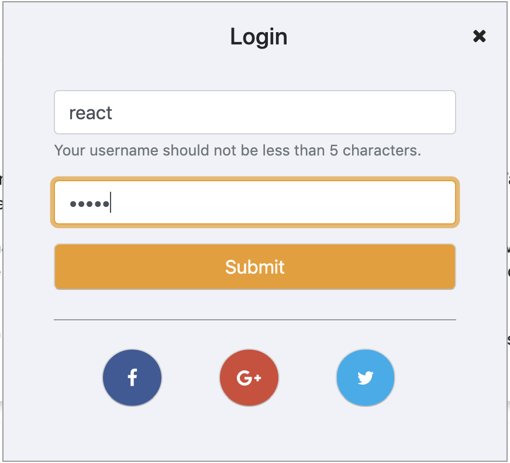
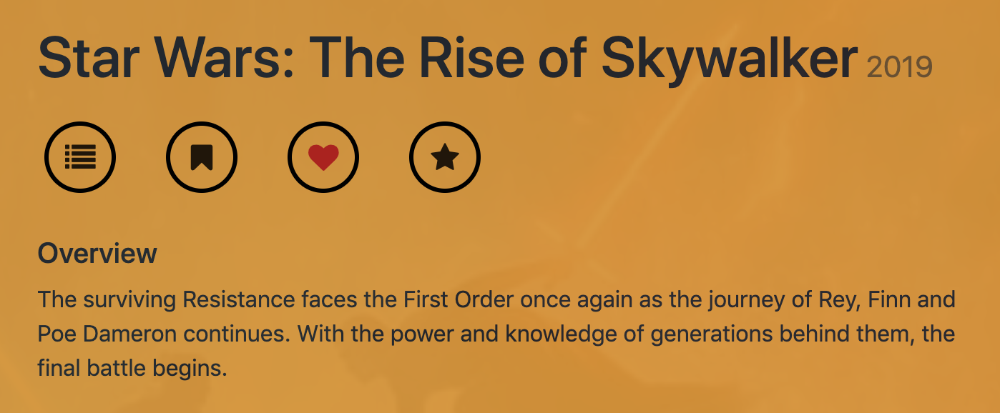

# Sesame Movie React Server

#### Features

This movie website is developed for rating and archiving the movies for each user. The data of this movie site is from **the movie database(TMDB)**. The features implemented in this site include:

1. **Movie Browsing**

   On the front page of the Sesame Movie, I implemented two decks of movies in order to display movies in the form of cards. Each card is comprised of a fixed-size poster, movie's title and its rating from TMDB. There is also a group of forwarding and backward arrows to help the user to navigate to a different group of cards. 

   

   When the cursor is hovering over the poster, there will be a popup window showing the detailed introduction of the corresponding movie including the movie's full name, publishing date and content of the movie.

   

   The movie genres deck also provides tags to navigate to each genre by clicking on the corresponding text

   

   

2. **Movie Details**

   By clicking on each movie's poster, the user will be able to navigate to the detail page of each movie. The detailed information of a movie includes a high-resolution poster of the movie, the movie name and its publishing date, a detailed overview and the genres it belongs to. There is also a background image crossing the whole width of the page.

    

   Below the detailed information of the movie, there lists the top-billed casts and top reviews in the form of decks

   

   

3. **User Login and Like a Movie**

   The website also supports users to register or login. After logging in, the registered user name will be shown instead of the login button. 
   The login popup is shown as follows:

   

   The header after login when we are using the user name of *react*:

   

   After logging in, the user can keep their own record of liked movies by clicking on the heart icon. If a movie is already in the list of favorite movies, the heart icon will be shown as red:

   

   By clicking on the red heart again, the user can remove the movie from the favorite list.

####Implementations

The front end server is implemented in React.js. Its components mainly fall into the following several categories:

- The content page: Contains the elements in the main page
  - Header.js: The website logo, search bar and login buttons.
  - BriefToolTip.js: The popup tooltip when hovering curser on the movie poster.
  - MovieCard.js and MovieCards.js: movie card and movie card decks.
  - MovieGenres.js and MovieTrending.js: movie genres deck, movie trending deck and their navigation logics.
- The detailed page: Contains the detail information of a movie
  - CastCrews.js and CastDetail.js: top billing casts card and deck
  - MovieDetail.js and DetailInfo.js: detailed information of a movie, including the banner background image, poster, movie genres and introduction
  - MovieButtons.js: Four buttons for users to take any action on a movie, currently only the function of *like a movie* is implemented
  - Reviews.js and ReviewDetail.js: Review cards and the review deck holding the reviews
- Login: The logic of user registration, login and log off
  - LoginBar.js: the appearance of the login and register buttons, depending on the status of whether user has logged in
  -  LoginPopup.js: the appearance and logic of the login popup window
  - RegisterPopup.js: the appearance and logic of the register popup window

#### Available Scripts/Commands

This project was bootstrapped with [Create React App](https://github.com/facebook/create-react-app). In the project directory, you can run:

### `npm start`

Runs the app in the development mode. 
Open [http://localhost:3000](http://localhost:3000) to view it in the browser.

The page will reload if you make edits. 
You will also see any lint errors in the console.

### `npm test`

Launches the test runner in the interactive watch mode. 
See the section about [running tests](https://facebook.github.io/create-react-app/docs/running-tests) for more information.

### `npm run build`

Builds the app for production to the `build` folder. 
It correctly bundles React in production mode and optimizes the build for the best performance.

The build is minified and the filenames include the hashes. 
Your app is ready to be deployed!

See the section about [deployment](https://facebook.github.io/create-react-app/docs/deployment) for more information.

### `npm run eject`

**Note: this is a one-way operation. Once you `eject`, you can’t go back!**

If you aren’t satisfied with the build tool and configuration choices, you can `eject` at any time. This command will remove the single build dependency from your project.

Instead, it will copy all the configuration files and the transitive dependencies (Webpack, Babel, ESLint, etc) right into your project so you have full control over them. All of the commands except `eject` will still work, but they will point to the copied scripts so you can tweak them. At this point you’re on your own.

You don’t have to ever use `eject`. The curated feature set is suitable for small and middle deployments, and you shouldn’t feel obligated to use this feature. However we understand that this tool wouldn’t be useful if you couldn’t customize it when you are ready for it.
